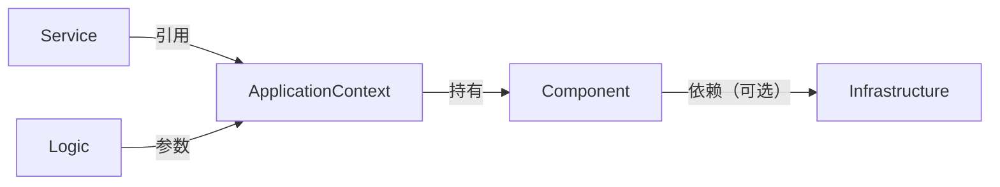

# Atomic Architecture

一种用于组织应用代码的架构约定。它按职责、状态与调用关系，将代码划分为 ApplicationContext、Service、Logic、Component 和 Infrastructure，并规定各类代码的生命周期与依赖方向。

## 核心理念

1. **业务逻辑原子化**：Logic 层是原子化的业务函数，不持有生命周期状态
2. **状态集中管理**：所有状态由 ApplicationContext 和 Component 集中管理，避免散落在业务逻辑中
3. **调用方与被调用方分离**：依赖方向明确，禁止循环依赖

## ApplicationContext（应用上下文）

进程级单例，与进程同生命周期，在应用启动时创建。

- 持有并管理 Component 实例
- 提供进程级共享状态和共享能力的访问入口
- Logic 通过 ApplicationContext 访问所需能力
- 不负责业务编排

## Service（主动逻辑入口）

系统的主动逻辑入口，如定时任务、MQ 消费者、HTTP 处理器等。

- 生命周期通常与 ApplicationContext 一致，也可按需启动与停止
- 引用 ApplicationContext，但不负责创建 ApplicationContext
- 负责组织 Logic 的调用顺序与入口级流程
- 不承载可复用的业务规则

## Logic（原子业务逻辑）

无生命周期状态的业务逻辑单元，用于表达具体业务规则。

- 负责业务规则，以及与该规则直接相关的校验、计算、转换和局部决策
- 自身不保存跨调用状态；不得持有连接、缓存、队列、会话、后台任务等进程期状态
- 可产生副作用，但副作用只能通过参数传入的 ApplicationContext 完成
- 不负责资源初始化、资源销毁和系统入口监听
- 是否为纯函数不影响归类；归类依据是是否持有生命周期状态
- **自演化规则**：当同一逻辑在多个地方重复出现时，自然演化为新的 Logic

## Component（业务组件）

具有生命周期状态或资源协调责任的业务通用能力单元。

- 定义条件：满足以下任一条件时，可归类为 Component：需要持有跨调用状态；需要协调资源、会话、缓存、队列或状态推进；需要向多个 Logic 或 Service 提供稳定接口
- 非定义条件：是否会被复用，不决定其是否成为 Component；无生命周期状态的复用代码仍应保持为 Logic
- 边界约束：一个 Component 只负责一个状态域或能力域，不承担跨场景业务编排
- 典型形式包括会话管理、状态机、任务队列、带缓存或连接复用的业务能力、外部 SDK 的业务封装层
- 可以是基础设施的业务适配层（如基于 Redis 的用户上下文管理器）
- 也可以是纯业务通用能力（如基于内存的任务队列、状态机）
- 被 ApplicationContext 持有和管理

## Infrastructure（基础设施）

底层技术资源及其原始客户端，如数据库连接池、Redis 客户端、ES 客户端等。

- 生命周期与进程相同
- 默认由 Component 依赖（可选），不直接向 Logic 暴露具体客户端实现
- 如确有必要供 Logic 直接使用，应由 ApplicationContext 暴露稳定能力，而不是暴露具体基础设施类型

## 依赖关系

**约束**：
- Logic 只能依赖参数传入的 ApplicationContext
- Logic 禁止直接依赖具体 Component 类型或具体 Infrastructure 类型
- 无生命周期状态的复用代码应保持为 Logic，不应仅因复用而升级为 Component
- Component 可依赖 Infrastructure，但对 Logic 暴露的应是业务能力，而非基础设施客户端
- Component 应聚焦单一状态域或能力域，不承担跨场景业务编排
- Service 引用 ApplicationContext，但 ApplicationContext 不依赖 Service

## 跨语言适配指南

> **注意**：ApplicationContext 是本架构的应用上下文概念，与 Go 语言的 `context.Context`（请求上下文）不同。

### Java/Spring
- **ApplicationContext**：通常由 Spring 容器管理其生命周期
- **Service**：@Service 或 @Component 注解的类，实现 Lifecycle 接口支持动态启停
- **Logic**：优先使用 @FunctionalInterface 注解的类，或单公开方法的类
- **Component**：@Component 注解的类，可通过 @Autowired 注入

### Go
- **ApplicationContext**：单例 struct，全局可访问（注意：与 Go 的 `context.Context` 不同）
- **Service**：独立的 goroutine，管理生命周期
- **Logic**：package 级函数，ApplicationContext 作为第一个参数
- **Component**：接口实现，被 ApplicationContext 持有
